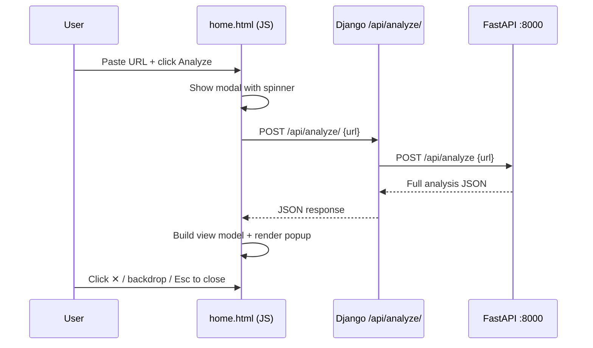

# Walkthrough: Inline URL Analysis Popup

## What Changed

The home page's **Analyze** form now shows results in a **popup modal** right on the page instead of navigating to `/report/`. The popup mirrors the Chrome extension's side panel — showing classification, score, security checks, AI analysis, government metadata, signals, and reasons.

### Files Modified

| File | Change |
|------|--------|
| [`views.py`](file:///e:/FakeOut/FakeOut/FakeOutApp/views.py) | Added `analyze_api` view (AJAX POST proxy to FastAPI backend) + `@ensure_csrf_cookie` on `home` |
| [`urls.py`](file:///e:/FakeOut/FakeOut/FakeOutApp/urls.py) | Added `path('api/analyze/', ...)` |
| [`home.html`](file:///e:/FakeOut/FakeOut/FakeOutApp/templates/FakeOutApp/home.html) | Form now submits via JS `fetch`. Added modal overlay HTML + inline `<script>` with full `buildViewModel` logic |
| [`style.css`](file:///e:/FakeOut/FakeOut/FakeOutApp/static/FakeOutApp/css/style.css) | Added ~500 lines of modal CSS — glassmorphism overlay, slide-up animation, score bar gradients, security checks grid, responsive breakpoints |

### How It Works

### Popup Sections (conditional)

- **Classification badge** — Government Verified / Low Risk / Suspicious / High Risk
- **Risk score** with animated gradient bar
- **Government verified** pill (if `.gov` domain confirmed)
- **Official site suggestion** (if suspicious/high-risk + official URL known)
- **AI Analysis** card with explanation + confidence
- **Government Intelligence** metadata table
- **Security Checks** grid (✓ green / ⚠ amber)
- **Why this score?** reasons list
- **All Signals** detailed list
- **View Full Report** link → `/report/?url=...`

### Interactions

- Close via **✕ button**, clicking the **backdrop**, or pressing **Escape**
- **Retry** button on error state
- Auto-analyze if URL comes via query string (`?url=...`)

## Testing

**Verified end-to-end** with both servers running:
- Django on `http://127.0.0.1:8001`
- FastAPI on `http://127.0.0.1:8000`

Test result for `https://www.google.com`:
- Classification: **LOW_RISK**
- Score: **100/100**
- Signals: HTTPS ✓, SSL valid ✓, no redirects ✓, no suspicious content ✓
- AI: "The website appears to be a general private platform or service" (92% confidence)
